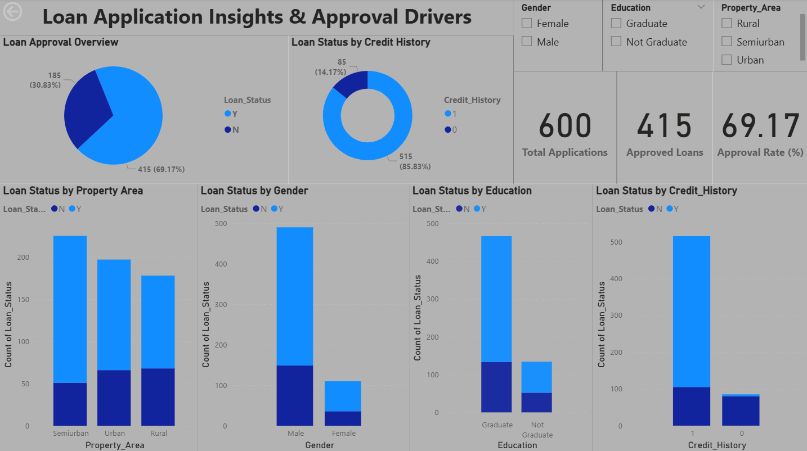

#  Loan Approval Prediction

This project uses **machine learning** and **business intelligence** to predict whether a loan will be approved based on applicant information such as income, employment status, credit history, loan amount, and more. It combines Python-based modeling with Power BI dashboarding to deliver actionable insights for credit risk evaluation.

---

## 📊 Dataset

The dataset contains historical loan application records with the following features:

- Gender, Marital Status, Education  
- Applicant & Coapplicant Income  
- Loan Amount, Loan Term  
- Credit History  
- Loan Status (Target Variable)

---

## 🚀 Techniques Used

### 🔹 Data Preparation
- Handling missing values  
- Encoding categorical variables  
- Feature engineering for model robustness

### 🔹 Exploratory Data Analysis (EDA)
- Visualizations using Matplotlib & Seaborn  
- Distribution analysis and correlation checks

### 🔹 Model Building
- Trained a **Random Forest Classifier**  
- Achieved **83% accuracy** and strong precision on validation data  
- Evaluated using confusion matrix, precision, recall, and F1-score

---

## 📈 Power BI Dashboard

An interactive dashboard was built to visualize:
- Loan approval trends by gender, education, property area, and credit history  
- Key metrics: Total Applications, Approval Rate, Approved Loans

> 📌 **Dashboard Title:** _Loan Application Insights & Approval Drive_  

---

## 🖼️ Dashboard Preview

> This dashboard visualizes loan approval trends, and demographic insights using Power BI.

---

## ✅ Results & Impact

- Delivered a predictive model with **83% accuracy**  
- Enabled visual storytelling through Power BI for stakeholder engagement  
- Highlighted key drivers of loan approval to support data-driven lending decisions  
- Demonstrated end-to-end workflow from raw data to business-ready insights

---

## 📎 Repository Contents

- `loan_approval_prediction.ipynb` – ML model development notebook  
- `dashboard.png` – Power BI dashboard screenshot
- `Loan Application Insights.pbix` – Power BI dashboard file for interactive loan approval analysis 
- `dataset/` – Raw and cleaned data files  
- `README.md` – Project overview and documentation

---
